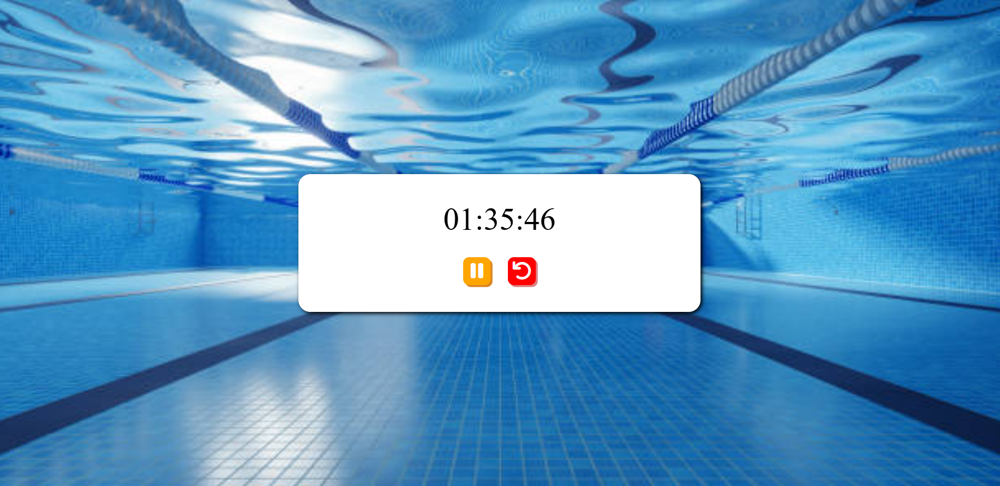

# Counter ⌚

A small JavaScript project that implements a simple counter. The user can increase, decrease, and reset the counter using basic DOM manipulation.

## Key Concepts Used 🧩

- `document.getElementById()`
- `addEventListener()`
- `textContent`

## Programming Languages Used 🛠️

- HTML
- CSS
- JavaScript

## Screenshot 📸

# Stop Watch ⌚

A small JavaScript project that implements a simple stopwatch. The user can start, pause, and reset the timer using basic DOM manipulation.

## Key Concepts Used 🧩

- `document.querySelector()`
- `document.getElementById()`
- `innerHTML & innerText`
- `addEventListener()`
- `window.setInterval()`
- `window.clearInterval()`

## Programming Languages Used 🛠️

- HTML
- CSS
- JavaScript

## Screenshot 📸

# Digital Clock ⏲️

A simple digital clock that displays the current time and updates every second in real time. The project includes a toggle that allows switching between 12-hour and 24-hour time formats. It demonstrates core JavaScript concepts such as DOM manipulation, event handling, and time-based updates.

## Features ✨

- Displays the current system time
- Updates automatically every second
- Toggle between 12-hour and 24-hour formats
- Real-time DOM updates using JavaScript
- Clean and minimal user interface

## Key Concepts Used 🧩

- DOM selection `document.getElementById()`
- Repeat code `setInterval()`
- Event handling `addEventListener()`
- Reading and updating values`.checked` `.textContent`
- Conditional (Ternary) Operator `condition? value1: value2`

## Programming Languages Used 🛠️

- HTML
- CSS
- JavaScript

## Screenshot 📸

