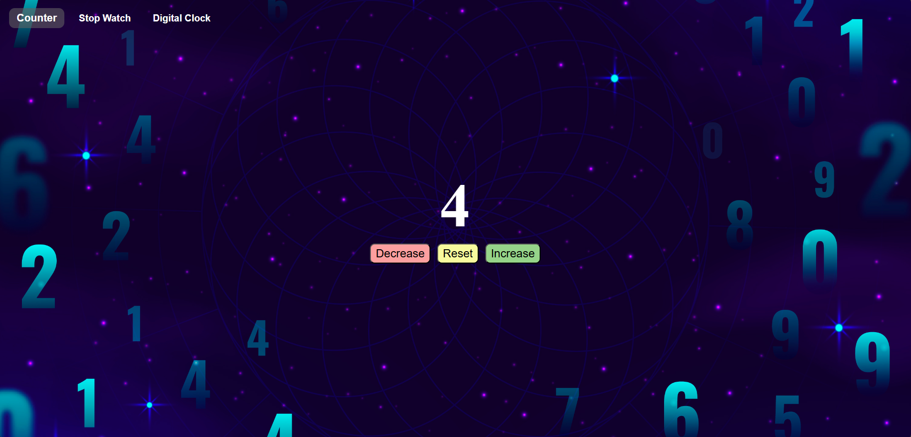
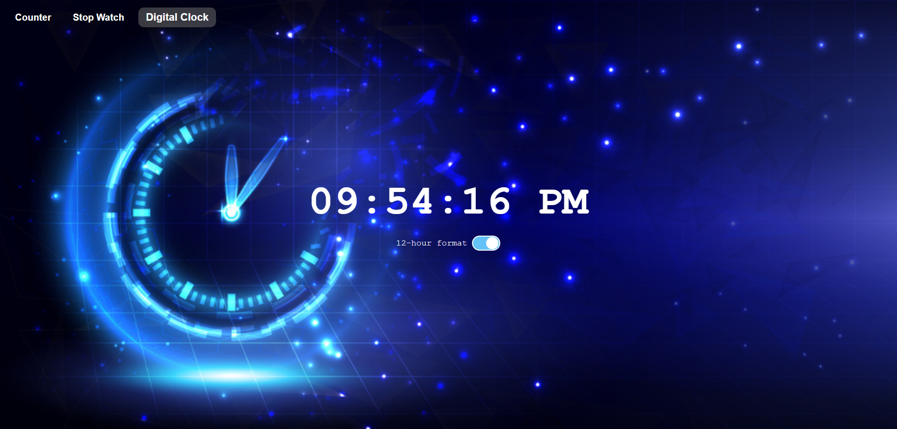
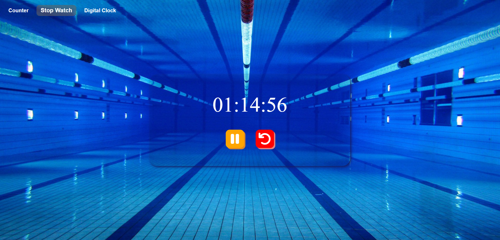

## Time Tools 🕓

A collection of three interactive time-based JavaScript applications: a Counter, Stopwatch, and Digital Clock. Each tool demonstrates fundamental JavaScript concepts while providing useful time-tracking functionality.

## Overview 🎯

Time Tools is a unified project that combines three separate time-management applications into one cohesive interface. Each tool serves a different purpose and showcases various JavaScript concepts:

- **Counter** 🔢: Simple increment/decrement counter
- **Stopwatch** ⏱️: Track elapsed time with start/pause/reset controls
- **Digital Clock** ⌚: Real-time clock with 12/24-hour format toggle

## Projects Included 🧰

### 1. Counter 🔢

A basic counter that allows users to increase, decrease, and reset a numerical value.

- **Key Concepts:** 🧩
  - DOM selection `document.getElementById()`
  - Event handling `addEventListener()`
  - Reading and updating values `textContent`

### 2. Stopwatch ⏱️

A functional stopwatch that tracks time with start, pause, and reset capabilities.

- **Key Concepts:** 🧩
  - DOM selection `document.querySelector()` `document.getElementById()`
  - Reading and updating values `innerHTML` `innerText`
  - Event handling `addEventListener()`
  - Repeat code `window.setInterval()`
  - Stopping code execution `window.clearInterval()`

### 3. Digital Clock ⌚

A real-time clock that displays the current system time with format toggle functionality.

- **Key Concepts:** 🧩
  - DOM selection `document.getElementById()`
  - Repeat code `setInterval()`
  - Event handling `addEventListener()`
  - Reading and updating values `checked` `textContent`
  - Conditional (Ternary) Operator `condition? value1: value2`

## Features ✨

- **Clean, intuitive interface**: Each tool has its own dedicated section
- **Real-time updates**: Live time display and stopwatch functionality
- **Format toggle**: Switch between 12-hour and 24-hour clock formats
- **Responsive design**: Works seamlessly across different screen sizes
- **Modular code structure**: Each tool's functionality is independently implemented

## Programming Languages Used 🛠️

- HTML
- CSS
- JavaScript

## Screenshots 📸

### Counter Interface

### Stopwatch Interface

### Digital Clock Interface

