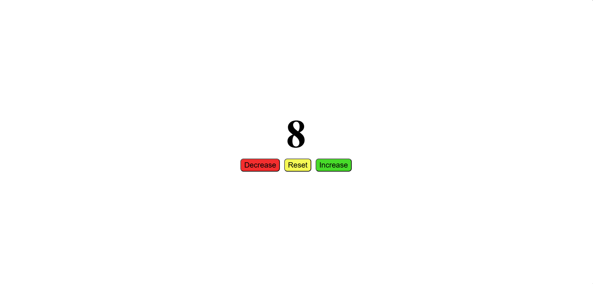

# Counter ⌚

A small JavaScript project that implements a simple counter. The user can increase, decrease, and reset the counter using basic DOM manipulation.

## Key Concepts Used 🧩

- `document.getElementById()`
- `addEventListener()`
- `textContent`

## Programming Languages Used 🛠️

- HTML
- CSS
- JavaScript

## Screenshot 📸

