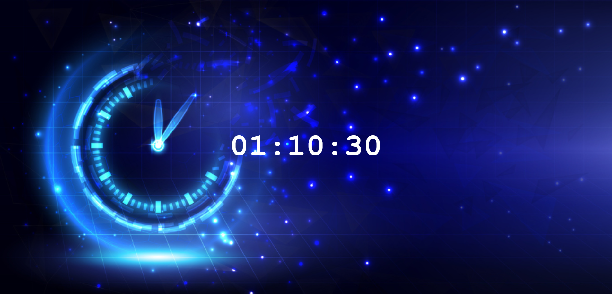

# Digital Clock ⏲️

A simple digital clock that displays the current time and updates every second in real time. This project demonstrates core JavaScript concepts related to DOM manipulation and time-based updates.

## Key Concepts Used 🧩

- DOM selection `document.getElementById()`
- Repeat code `setInterval()`
- Event handling `addEventListener()`
- Updating values `.textContent`
- Conditional (Ternary) Operator `condition? value1: value2`

## Programming Languages Used 🛠️

- HTML
- CSS
- JavaScript

## Screenshot 📸

## Planned Features 🚀

- Add toggle between 12-hour and 24-hour format
